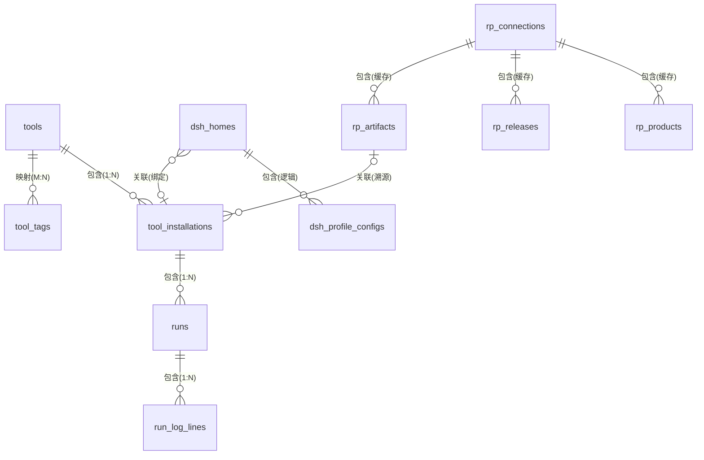

# 本地数据库建模(SQLite)

> 状态:**已确认**(2026-09-02 用户拍板 §7 全部 6 项:SQLite 替换 / 日志入库+30 天·万行滚动保留 /
> 平台缓存三表 TTL 10 分钟 / run_mode 建模 / 连接表单行 MVP / DSH 泛化 code='dsh')。
> 上游对接域以 release-platform 实测 schema 为准(migrations/000001、000028;102 部署)。

## 1. 选型与边界

- 引擎:**SQLite**(rusqlite bundled,WAL 模式),落盘 `~/.dsh-launcher/launcher.db`。
- 取代 `registry.json`;旧文件仅作一次性导入源,导入后改名 `registry.json.imported`。
- 命名对齐平台惯例:snake_case、同实体同名,缓存表加 `rp_` 前缀。
- 本地 schema 版本管理复用 `schema_migrations` 表(与平台同构)。

## 2. 域划分

| 域 | 表 | 说明 |
|---|---|---|
| 系统域 | schema_migrations, settings, onboarding_state | 框架级 |
| 工具域 | tools, tool_installations, tool_tags | 本地核心 |
| 运行域 | runs, run_log_lines | DSH 与通用运行统一 |
| DSH 专属域 | dsh_homes, dsh_profile_configs | Home/Profile 深度链路 |
| 平台集成域 | rp_connections, rp_products, rp_releases, rp_artifacts | 目录缓存与溯源 |

## 3. ER 总览

## 4. 表结构

### 4.1 系统域

**schema_migrations** — 本地 schema 版本

| 字段 | 类型 | 约束 | 说明 |
|---|---|---|---|
| version | INTEGER | PK | 迁移序号,与平台规则一致(并行占号先同步再定号) |
| applied_at | INTEGER | NOT NULL | epoch ms |

**settings**(KV;替代 Settings 结构体)

| 字段 | 类型 | 约束 | 说明 |
|---|---|---|---|
| key | TEXT | PK | npm_registry / node_dist_mirror / use_system_node / ui_* |
| value_json | TEXT | NOT NULL | JSON 值 |
| updated_at | INTEGER | NOT NULL | |

**onboarding_state**(单行)

| 字段 | 类型 | 约束 | 说明 |
|---|---|---|---|
| id | INTEGER | PK CHECK(id=1) | 单行表 |
| step | TEXT | NOT NULL | welcome…done(沿用现有枚举) |
| completed | INTEGER | NOT NULL DEFAULT 0 | |
| updated_at | INTEGER | NOT NULL | |

### 4.2 工具域

**tools** — 工具注册(名称空间根)

| 字段 | 类型 | 约束 | 说明 |
|---|---|---|---|
| id | TEXT | PK | slug,如 `dsh`、`releasectl` |
| display_name | TEXT | NOT NULL | UI 展示名 |
| code | TEXT | UNIQUE NOT NULL | 程序识别码;`dsh` 走专属 UI |
| run_mode | TEXT | NOT NULL DEFAULT 'service' CHECK IN('service','oneshot') | 启停语义(待确认 §7.4) |
| description | TEXT | '' | |
| created_at / updated_at | INTEGER | NOT NULL | epoch ms |

**tool_installations** — 安装/登记(来源泛化,单表继承)

| 字段 | 类型 | 约束 | 说明 |
|---|---|---|---|
| id | TEXT | PK | 沿用现有 fresh_id 规则 |
| tool_id | TEXT | FK→tools ON DELETE CASCADE | 工具归属 |
| source | TEXT | CHECK IN('npm','dev','manual','platform') | 扩展判别列 |
| version_label | TEXT | '' | 展示用:spec/semver/标签 |
| bin | TEXT | NOT NULL | 启动命令(可含参数 token) |
| cwd | TEXT | | 默认工作目录 |
| fingerprint | TEXT | | `<bin> --version` 实测 |
| fingerprint_at | INTEGER | | |
| install_dir | TEXT | | npm/platform 落盘目录;dev/manual 为空 |
| spec | TEXT | | npm 子类型:`@scope/name@ver` |
| repo_path | TEXT | | dev 子类型 |
| artifact_id | INTEGER | FK→rp_artifacts | platform 子类型溯源;其余 NULL |
| status | TEXT | DEFAULT 'active' CHECK IN('active','broken') | bin 失联标记 |
| created_at / updated_at | INTEGER | NOT NULL | |

子类型约束(表内 CHECK):
`source='npm' → spec 非空;source='dev' → repo_path 非空;source='platform' → artifact_id 非空`。

**tool_tags** — 工具↔标签映射

| 字段 | 类型 | 约束 |
|---|---|---|
| tool_id | TEXT | FK→tools CASCADE |
| tag | TEXT | NOT NULL |
| | | PK(tool_id, tag);另建 tag 索引 |

### 4.3 运行域

**runs** — 统一运行记录(DSH profile 运行与通用工具运行泛化合一)

| 字段 | 类型 | 约束 | 说明 |
|---|---|---|---|
| id | INTEGER | PK AUTOINCREMENT | |
| installation_id | TEXT | FK→tool_installations | 运行的总是某个安装 |
| context | TEXT | CHECK IN('tool','dsh_profile') | 角色泛化判别 |
| home_id | TEXT | | context='dsh_profile' 时 NOT NULL |
| profile | TEXT | | 同上 |
| args_json | TEXT | '[]' | 启动参数 |
| cwd | TEXT | | 实际 cwd |
| pid | INTEGER | | |
| started_at | INTEGER | NOT NULL | |
| ended_at | INTEGER | | 运行中为 NULL |
| exit_code | INTEGER | | |

CHECK:`(context='tool') OR (home_id IS NOT NULL AND profile IS NOT NULL)`。
运行锁保持文件锁(fs4),不入库(进程死亡自动释放语义)。

**run_log_lines** — 日志行(策略见 §7.2)

| 字段 | 类型 | 约束 |
|---|---|---|
| run_id | INTEGER | FK→runs CASCADE |
| seq | INTEGER | NOT NULL |
| is_err | INTEGER | NOT NULL DEFAULT 0 |
| line | TEXT | NOT NULL |
| | | PK(run_id, seq) |

### 4.4 DSH 专属域

**dsh_homes**

| 字段 | 类型 | 约束 | 说明 |
|---|---|---|---|
| id | TEXT | PK | |
| path | TEXT | UNIQUE NOT NULL | |
| bound_installation_id | TEXT | FK→tool_installations ON DELETE SET NULL | 绑定版本 |
| last_good_installation_id | TEXT | FK 同上 | 最后成功启动 |
| created_at | INTEGER | NOT NULL | |

**dsh_profile_configs**(可选,TR2;profile 本体仍是动态发现,此处存覆盖项)

| 字段 | 类型 | 约束 |
|---|---|---|
| home_id | TEXT | FK→dsh_homes CASCADE |
| profile | TEXT | NOT NULL |
| default_patch | TEXT | |
| extra_args_json | TEXT | '[]' |
| cwd | TEXT | |
| | | PK(home_id, profile) |

### 4.5 平台集成域

**rp_connections**(MVP 单行,建模为表支持多环境)

| 字段 | 类型 | 约束 | 说明 |
|---|---|---|---|
| id | TEXT | PK | 'default' |
| base_url | TEXT | NOT NULL | |
| auth_mode | TEXT | CHECK IN('password','bearer','devheaders') | |
| issuer_url / username / password | TEXT | password 模式 | |
| token | TEXT | bearer 模式 | |
| tenant / subject | TEXT | devheaders 模式 | |
| jwt_cache | TEXT | | 会话 JWT,进程内亦持有 |
| created_at / updated_at | INTEGER | NOT NULL | |

**rp_products / rp_releases / rp_artifacts** — 目录缓存(镜像平台键)

| 表 | 本地 PK | 平台键(UNIQUE) | 字段 |
|---|---|---|---|
| rp_products | rowid | (connection_id, id) | name, lifecycle, tenant_id, fetched_at |
| rp_releases | rowid | (connection_id, id) | version_id, channel, state, created_by, artifact_ids_json, platform_created_at, fetched_at |
| rp_artifacts | rowid | (connection_id, id) | version_id, os, arch, uri, sha256, size_bytes, fetched_at |

平台 releases↔artifacts 是 JSON 数组内嵌(`artifact_ids`),非关系映射;缓存如实镜像,
不做本地映射表。缓存仅作离线浏览/更新检查,**事实源始终是平台 API**(§7.5)。

## 5. 四类关系确认清单

| 关系 | 类型 | 定义 |
|---|---|---|
| tools → tool_installations | 包含 1:N(组合) | 删工具级联删安装记录;npm/platform 安装的磁盘目录同步清理,dev/manual 只摘登记 |
| runs → run_log_lines | 包含 1:N(组合) | 级联删;受保留策略约束(§7.2) |
| dsh_homes → dsh_profile_configs | 包含 1:N(逻辑) | profile 本体动态发现,表只存覆盖项 |
| tool_installations → runs | 包含 1:N | 删安装级联删历史 |
| rp_connections → rp_* 缓存 | 包含 1:N | 级联删 |
| dsh_homes ↔ tool_installations(bound / last_good) | 关联 N:1,可空 | ON DELETE SET NULL |
| tool_installations ↔ rp_artifacts | 关联 N:1,可空(溯源) | 仅 platform 来源;ON DELETE RESTRICT(缓存先于安装清理) |
| tools ↔ tags | 映射 M:N | tool_tags 连接表 |
| tool_installations.source 子类型 | 扩展(单表继承) | 判别列 + 子类型专有列 + CHECK;理由:子类型差异 ≤2 列,无跨型查询需求 |
| runs.context 运行角色 | 扩展(角色判别) | tool / dsh_profile 共用一行结构,DSH 上下文为可空角色列 |
| tools.code='dsh' | 扩展(实例特化) | DSH 不再有独立表;专属能力按 code 分派到专属域表 |

## 6. registry.json 迁移映射

| 旧 | 新 |
|---|---|
| versions[].tool(缺省 dsh) | tools(按 code upsert)+ tool_installations.tool_id |
| versions[].kind npm/dev/manual | tool_installations.source;spec/repo_path 落对应列 |
| versions[].spec/bin/cwd/fingerprint/addedAtMs | 同名列 |
| homes[].boundVersionId / lastGoodVersionId | dsh_homes 两个 FK(按旧 version id 查新 installation id) |
| history[] | runs(context 按 home_id 是否 `__tool__` 判定;无日志行) |
| settings.npmRegistry / nodeDistMirror / useSystemNode | settings KV |
| settings.rp | rp_connections('default') |
| onboarding | onboarding_state |

导入事务化:任一步失败回滚且保留旧文件;成功后 `registry.json` → `registry.json.imported`。

## 7. 决策记录(2026-09-02 已确认)

1. **存储选型**:SQLite(rusqlite bundled)替换 registry.json,JSON 仅作导入源 —— ✅ 确认
2. **日志存储**:run_log_lines 入库;保留 30 天、单 run 上限 1 万行,超限滚动丢弃最旧并打点 —— ✅ 确认
3. **平台缓存**:rp_* 三表保留,TTL 10 分钟,事实源始终是平台 API —— ✅ 确认
4. **tools.run_mode**:service/oneshot 建模,UI 按此区分启停语义 —— ✅ 确认
5. **多连接**:rp_connections 建表,MVP 只用 'default' 单行 —— ✅ 确认
6. **DSH 泛化**:DSH 作为 tools.code='dsh' 普通行,专属 UI 按 code 分派 —— ✅ 确认
