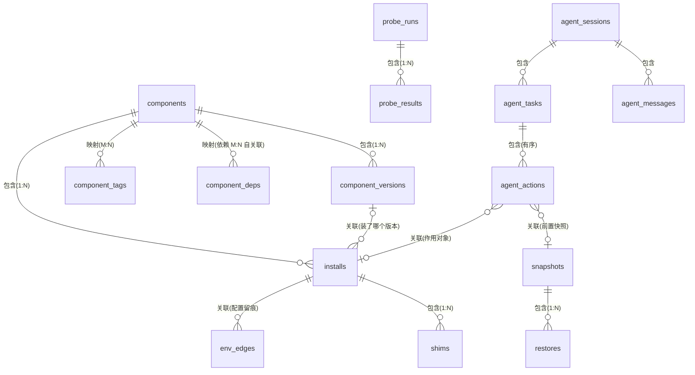

# 数据库建模 v2(装机引擎 + 环境管家)

> 状态:**待确认**。按 DESIGN-PRODUCT.md 宪章重构,v1(工具台模型)全盘作废。
> 引擎:SQLite(rusqlite bundled,WAL),落盘 `~/.dsh-launcher/launcher.db`,snake_case,
> schema 版本用 schema_migrations 表管理。时间统一 epoch ms。

## 1. 域划分(六域 16 表)

| 域 | 表 | 职责 |
|---|---|---|
| 系统域 | schema_migrations, settings, onboarding_state | 框架级 |
| 主机体检域 | host_profile, probe_runs, probe_results | 宿主环境实况 |
| 组件目录域 | components, component_versions, component_deps, component_tags | 可安装什么、依赖什么 |
| 本机安装域 | installs, shims, env_edges | 装了什么、在哪、怎么暴露、改了哪些配置 |
| 快照恢复域 | snapshots, restores | 保命能力(备份/回滚) |
| AI 引擎域 | engine_config, agent_sessions, agent_messages, agent_tasks, agent_actions | 体检→计划→执行→复检 |

## 2. ER 总览

## 3. 表结构

### 3.1 系统域

**schema_migrations**:version PK / applied_at。
**settings**:key PK / value_json / updated_at(镜像源、代理、主题、保留策略等 KV)。
**onboarding_state**:id PK CHECK(id=1) / step / completed / updated_at。

### 3.2 主机体检域

**host_profile**(单行,机器快照)

| 字段 | 类型 | 说明 |
|---|---|---|
| id | INTEGER PK CHECK(id=1) | |
| os / os_version / arch | TEXT | macos-15.2 / aarch64 |
| hostname / shell | TEXT | 默认 shell(rc 定位用) |
| cpu_model / mem_mb / disk_free_mb | TEXT / INTEGER | 体检基线 |
| created_at / updated_at | INTEGER | |

**probe_runs**(一次体检)

| 字段 | 类型 | 约束 | 说明 |
|---|---|---|---|
| id | INTEGER PK AUTOINCREMENT | | |
| trigger | TEXT | CHECK IN('manual','ai','schedule','pre_action') | 谁发起 |
| task_id | INTEGER | FK→agent_tasks NULL | ai 触发时回链 |
| status | TEXT | CHECK IN('running','done','failed') | |
| overall | TEXT | CHECK IN('ok','warn','fail') NULL | done 后汇总 |
| started_at / finished_at | INTEGER | | |

**probe_results**(逐项结果)

| 字段 | 类型 | 约束 | 说明 |
|---|---|---|---|
| id | INTEGER PK | | |
| run_id | INTEGER | FK→probe_runs CASCADE | |
| check_key | TEXT | NOT NULL | `node.version`、`path.disk_free`、`net.registry`… |
| status | TEXT | CHECK IN('ok','warn','fail','unknown') | |
| value | TEXT | | 实测值(如 20.11.0) |
| detail_json | TEXT | | 路径/错误等 |
| | | UNIQUE(run_id, check_key) | |

### 3.3 组件目录域

**components**(可安装物;内置知识库 + 用户自建)

| 字段 | 类型 | 约束 | 说明 |
|---|---|---|---|
| id | TEXT PK | slug(`node`,`python`,`git`,`dsh`,`claude-code`) | |
| name | TEXT NOT NULL | 展示名 | |
| kind | TEXT | CHECK IN('runtime','tool','ai_tool') | 扩展判别 |
| description | TEXT | DEFAULT '' | |
| homepage | TEXT | | |
| check_cmd | TEXT | | 验证模板,如 `{bin} --version` |
| is_builtin | INTEGER | DEFAULT 1 | 内置配方 vs 用户自建 |
| created_at / updated_at | INTEGER | | |

**component_versions**(安装配方;版本×平台)

| 字段 | 类型 | 约束 | 说明 |
|---|---|---|---|
| id | INTEGER PK | | |
| component_id | TEXT | FK→components CASCADE | |
| version | TEXT | NOT NULL | `20.11.0` / `latest` 别名由同步时物化 |
| source_type | TEXT | CHECK IN('dist','npm','archive','platform') | 扩展判别:官方发行档/npm 包/压缩包/release-platform 制品 |
| source_ref | TEXT | NOT NULL | uri 或 spec(`@deepseek-ai/dsh@x`) |
| os / arch | TEXT NULL | | NULL=跨平台;镜像平台命名(darwin/arm64) |
| sha256 | TEXT | | 校验 |
| is_default | INTEGER | DEFAULT 0 | 推荐版本 |
| deprecated | INTEGER | DEFAULT 0 | |
| created_at | INTEGER | | |
| | | UNIQUE(component_id, version, os, arch) | |

**component_deps**(依赖 = 自关联映射,带约束)

| 字段 | 类型 | 约束 |
|---|---|---|
| id | INTEGER PK | |
| component_id | TEXT | FK→components CASCADE |
| dep_id | TEXT | FK→components RESTRICT |
| version_constraint | TEXT | 如 `>=20`,`''`=任意 |
| | | UNIQUE(component_id, dep_id) |

**component_tags**:component_id FK / tag / PK(component_id, tag)。【映射 M:N】

### 3.4 本机安装域

**installs**(托管槽位 + 系统检测)

| 字段 | 类型 | 约束 | 说明 |
|---|---|---|---|
| id | INTEGER PK | | |
| component_id | TEXT | FK→components RESTRICT | |
| version_id | INTEGER | FK→component_versions NULL | system 检测项可空 |
| scope | TEXT | CHECK IN('managed','system') | 扩展判别:managed=本软件装的;system=检测到的既有安装(只读) |
| slot_path | TEXT | UNIQUE | managed:`~/.dsh-launcher/managed/<comp>/<ver>`;system:实测路径 |
| status | TEXT | CHECK IN('detected','installing','active','inactive','broken','removed') | |
| installed_by | TEXT | CHECK IN('user','ai','system') | |
| check_output | TEXT | | 实测 `--version` 输出 |
| installed_at / updated_at | INTEGER | | |

部分唯一索引:同组件同 scope='managed' 仅一个 `active`(shim 入口唯一)。
卸载语义:managed 行 status→removed 后物理删槽位(保留历史行供审计);
system 行永不卸载,只提示「收编」(收编=TR 后期再议)。

**shims**(命令暴露;managed 专用)

| 字段 | 类型 | 约束 | 说明 |
|---|---|---|---|
| id | INTEGER PK | | |
| install_id | INTEGER | FK→installs CASCADE | |
| name | TEXT | UNIQUE | shims 目录内命令名唯一(PATH 单一入口) |
| target | TEXT | NOT NULL | 槽位内真实可执行 |
| created_at | INTEGER | | |

**env_edges**(对本机配置的全部改动留痕;卸载/回滚的还原依据)

| 字段 | 类型 | 约束 | 说明 |
|---|---|---|---|
| id | INTEGER PK | | |
| install_id | INTEGER | FK→installs SET NULL | PATH 总块等可空 |
| kind | TEXT | CHECK IN('path_block','env_var','rc_line') | |
| file_path | TEXT | NOT NULL | 如 ~/.zshrc |
| content | TEXT | NOT NULL | 写入内容(原文留痕) |
| created_at | INTEGER | | |
| removed_at | INTEGER NULL | | 还原时间 |

### 3.5 快照恢复域

**snapshots**(归档;managed_root + shell rc)

| 字段 | 类型 | 约束 | 说明 |
|---|---|---|---|
| id | INTEGER PK | | |
| kind | TEXT | CHECK IN('auto_pre_action','manual') | AI 变更前强制 auto |
| scope | TEXT | CHECK IN('managed_root','shell_rc','all') | |
| manifest_json | TEXT | NOT NULL | 槽位清单+rc 原文哈希 |
| archive_path | TEXT | UNIQUE | tar.zst 落盘 |
| size_bytes | INTEGER | | |
| created_at | INTEGER | | |
| note | TEXT | DEFAULT '' | |

**restores**:id PK / snapshot_id FK RESTRICT / triggered_by CHECK(user,auto) /
status CHECK(running,done,failed) / started_at / finished_at / detail。
保留策略:自动快照默认保留 20 份滚动,手动快照永久(settings 可调)。

### 3.6 AI 引擎域

**engine_config**(单行):id=1 / provider / model / base_url / api_key_ref(仅存 .env 键名,
绝不存密钥值)/ auto_apply INTEGER DEFAULT 0 / max_steps INTEGER DEFAULT 24 / updated_at。

**agent_sessions**:id PK / title / created_at / updated_at。
**agent_messages**:id PK / session_id FK CASCADE / role CHECK(user,assistant,system,tool) /
content TEXT / created_at。

**agent_tasks**(一次目标作业)

| 字段 | 类型 | 约束 | 说明 |
|---|---|---|---|
| id | INTEGER PK | | |
| session_id | INTEGER | FK→agent_sessions | |
| goal | TEXT | NOT NULL | 「装好 dsh 并能运行」 |
| plan_json | TEXT | | 步骤计划(确认前可变) |
| status | TEXT | CHECK IN('draft','awaiting_confirm','applying','verifying','done','failed','rolled_back') | |
| created_at / finished_at | INTEGER | | |

**agent_actions**(逐步执行与审计;失败路径全留痕)

| 字段 | 类型 | 约束 | 说明 |
|---|---|---|---|
| id | INTEGER PK | | |
| task_id | INTEGER | FK→agent_tasks CASCADE | |
| seq | INTEGER | NOT NULL | UNIQUE(task_id, seq) |
| action_type | TEXT | CHECK IN('probe','snapshot','install','activate','uninstall','path_edit','restore','verify','exec') | |
| title | TEXT | NOT NULL | 人话描述 |
| status | TEXT | CHECK IN('pending','running','done','failed','skipped','rolled_back') | |
| request_json / result_json | TEXT | | 入参与实测输出 |
| install_id | INTEGER NULL | FK→installs SET NULL | 作用对象 |
| snapshot_id | INTEGER NULL | FK→snapshots SET NULL | 变更类动作的前置快照 |
| error | TEXT | | |
| started_at / finished_at | INTEGER | | |

不变式:install/uninstall/path_edit/restore 类型动作完成前,其 snapshot_id 必须指向
已完成的 auto_pre_action 快照;verify 失败 → 任务置 rolled_back 并生成 restore 动作。

## 4. 四类关系确认清单

| 关系 | 类型 | 定义 |
|---|---|---|
| components → component_versions | 包含 1:N(组合) | 删组件级联删配方 |
| installs → shims | 包含 1:N(组合) | 删安装级联删命令入口 |
| probe_runs → probe_results;sessions→messages;tasks→actions;snapshots→restores | 包含 1:N | 级联 |
| installs.version_id → component_versions | 关联 N:1 可空 | system 检测可无配方 |
| agent_actions.install_id / snapshot_id | 关联 N:1 可空 | 作用对象与前置快照;SET NULL 保历史 |
| env_edges.install_id → installs | 关联 N:1 可空 | SET NULL(总 PATH 块无主) |
| components ↔ components | 映射 M:N 自关联 | component_deps 带版本约束(依赖图) |
| components ↔ tags | 映射 M:N | component_tags |
| components.kind(runtime/tool/ai_tool) | 扩展(单表继承) | 差异仅在展示与默认验证方式 |
| component_versions.source_type(dist/npm/archive/platform) | 扩展(单表继承) | source_ref 语义随类型;platform=既有 release-platform 目录流 |
| installs.scope(managed/system) | 扩展(单表继承) | system 只读不卸载;shims/env_edges 仅 managed |

## 5. 旧数据处置

- registry.json(旧启动器):导入映射降级为「检测已有 node/npm 并提示收编」;不再整体迁移
  (v1 模型的 homes/profiles/runs 属被否决的 DSH 启动器定位,不迁移)。
- ~/.dsh-launcher/versions 既有 npm 安装:首检识别为 installs(scope=managed,
  installed_by=system,version_id 可回填),纳入托管与卸载范围。

## 6. 待确认决策

1. **AI 引擎接入**:直连 LLM API 自研轻代理循环(建议,engine_config 可配 provider)
   还是内嵌 dsh 作为引擎运行时?
2. **内置目录范围**:首批组件 = Node LTS/Current、Python、Git + dsh、Claude Code、Codex CLI、
   Gemini CLI —— 增删?
3. **auto_apply 默认值**:计划默认需确认(建议,普通人可控)还是全自动一步到位?
4. **system 组件收编**:MVP 只读检测 + 收编按钮延后(建议)还是 MVP 即支持收编?
5. **快照保留**:auto 20 份滚动 + manual 永久(建议)还是统一 30 天?
